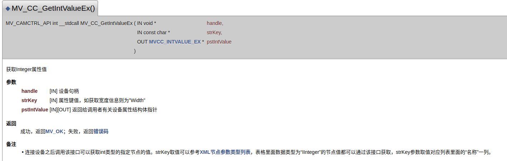

## Linux下工业相机的SDK二次开发


### 1.客户端软件MVS的安装

#### 1.1安装包的下载和解压

 去 [官网](https://www.hikrobotics.com/cn/machinevision/service/download) 下载两个软件安装，分别是客户端和开发环境。**（这里我们下载V2.1.1（Linux）和Runtime组件包（Linux））**。

工业相机文档/安装包中的不同安装版本

安装包里有各个系统及arm开发板使用的安装包，选择相应的安装包进行安装**（这里我们选择最后一个）**：


右键提取，进入提取后的文件夹，右键打开终端。

#### 1.2安装步骤

**Step1：切换root权限**

```apl
rm@rm:~/下载/MVS-2.1.1_x86_64_20211224$ sudo su
```

**Step2：运行安装脚本**

```apl
rm@rm:~/下载/MVS-2.1.1_x86_64_20211224$ ./setup.sh
```

安装完成后，/opt路径下会生成MVS文件夹，包含以下内容：


#### 1.3 MVS客户端的运行

进入bin目录，运行MVS，即可打开客户端


连接海康工业相机之后，通过其官方提供的MVS客户端，我们可以设置相关相机参数，来调整图像，达到我们想要的效果，**但是如此众多的相机参数，我们该如何集成进入我们程序呢，接下来就是我们的SDK二次开发**。


### 2.参数的设置

#### 2.1 SDK 用户指南的阅读

* 在 opt/MVS/doc 目录下，我们可以找到 [工业相机Linux SDK用户指南V3.2.0(C).html](file:///opt/MVS/doc/Machine%20Vision%20Camera%20SDK%20(C)_Developer%20Guide_V3.2.0_CH/html/index.html) ,经查询SDK文档，可以发现，他们提供了一套通用接口，来对相机进行参数获取与设置。

* 通用接口把相机参数，分成六大类，除command参数外，每一类提供Set/Get接口来设置与获取相关节点


​		如整形数据的获取与设置




* 相机所有开放的属性值都可参考 [相机参数节点表](file:///opt/MVS/doc/Machine%20Vision%20Camera%20SDK%20(C)_Developer%20Guide_V3.2.0_CH/html/_xE7_x9B_xB8_xE6_x9C_xBA_xE5_x8F_x82_xE6_x95_xB0_xE8_x8A_x82_xE7_x82_xB9_xE8_xA1_xA8.html) 进行查询，此节点表对每个节点的名称、数据类型、数值范围定义、访问模式和节点描述进行了详细说明。对着表可以对参数进行详细的设置。

  


#### 2.2 MVS 客户端的联合使用

​		通过查表，我们可以知道key值该填什么，key值的属性是什么，但是，这样子太慢了。为确定我想调的参数在xml表的位置，还需要在MVS客户端中进行定位。那么有没有更为简单快速的方法？
 	   通过观察MVS客户端，有一个更简单的方法能够知道相机参数的属性，类型等，可以快速方便的对参数进行操作

* 在MVS中找到自己想要的参数，鼠标选中它，在MVS右下角，参数描述中，能看看该参数的节点名、类型、取值范围、步进等信息


​     上图可知，图像宽度“Height”，其节点名为“Height”，类型是“int”，取值范围是32~2480,步进是2；根据类型，我们就可以选用      MV_CC_GetIntValue/MV_CC_SetIntValue来对该属性进行操作；

#### 2.3 六类参数的获取和设置(例)

- 获取/设置 Bool 类型节点值

```c++
        // 获取bool型变量
        // get IBoolean variable
        bool bGetBoolValue = false;
        nRet = MV_CC_GetBoolValue(handle, "ReverseX", &bGetBoolValue);
        if (MV_OK == nRet)
        {
            if (0 != bGetBoolValue)
            {
                printf("ReverseX current is true\n\n");
            }
            else
            {
                printf("ReverseX current is false\n\n");
            }
        }
        // 设置bool型变量
        // set IBoolean variable
        int nSetBoolValue;
        bool bSetBoolValue;
        printf("please input the ReverseX to set(bool): ");
        scanf("%d", &nSetBoolValue);
        if (0 != nSetBoolValue)
        {
            bSetBoolValue = true;
        }
        else
        {
            bSetBoolValue = false;
        }
        nRet = MV_CC_SetBoolValue(handle, "ReverseX", bSetBoolValue);
        if (MV_OK == nRet)
        {
            printf("Set ReverseX OK!\n\n");
        }
        else
        {
            printf("Set ReverseX Failed! nRet = [%x]\n\n", nRet);
        }
```

* 获取/设置 Enum 类型节点值

```C++
        // 获取enum型变量
        // get IEnumeration variable
        MVCC_ENUMVALUE stTriggerMode = {0};
        nRet = MV_CC_GetEnumValue(handle, "TriggerMode", &stTriggerMode);
        if (MV_OK == nRet)
        {
            printf("TriggerMode current value:%d\n", stTriggerMode.nCurValue);
            printf("supported TriggerMode number:%d\n", stTriggerMode.nSupportedNum);
            for (unsigned int i = 0; i < stTriggerMode.nSupportedNum; ++i)
            {
                printf("supported TriggerMode [%d]:%d\n", i, stTriggerMode.nSupportValue[i]);
            }
            printf("\n");
        }
        else
        {
            printf("get TriggerMode failed! nRet [%x]\n\n", nRet);
        }
        // 设置enum型变量
        // set IEnumeration variable
        unsigned int nTriggerMode = 0;
        printf("please input the TriggerMode to set:");
        scanf("%d", &nTriggerMode);
        nRet = MV_CC_SetEnumValue(handle, "TriggerMode", nTriggerMode);
        if (MV_OK == nRet)
        {
            printf("set TriggerMode OK!\n\n");
        }
        else
        {
            printf("set TriggerMode failed! nRet [%x]\n\n", nRet);
        }
```

* 获取/设置 Float 类型节点值

```C++
        // 获取float型变量
        // get IFloat variable
        MVCC_FLOATVALUE stExposureTime = {0};
        nRet = MV_CC_GetFloatValue(handle, "ExposureTime", &stExposureTime);
        if (MV_OK == nRet)
        {
            printf("exposure time current value:%f\n", stExposureTime.fCurValue);
            printf("exposure time max value:%f\n", stExposureTime.fMax);
            printf("exposure time min value:%f\n\n", stExposureTime.fMin);
        }
        else
        {
            printf("get exposure time failed! nRet [%x]\n\n", nRet);
        }
        // 设置float型变量
        // set IFloat variable
        float fExposureTime = 0.0f;
        printf("please input the exposure time to set: ");
        scanf("%f", &fExposureTime);
        nRet = MV_CC_SetFloatValue(handle, "ExposureTime", fExposureTime);
        if (MV_OK == nRet)
        {
            printf("set exposure time OK!\n\n");
        }
        else
        {
            printf("set exposure time failed! nRet [%x]\n\n", nRet);
        }
```

- 获取/设置 Int 类型节点值

```C++
        // 获取int型变量
        // get IInteger variable
        MVCC_INTVALUE stHeight = {0};
        nRet = MV_CC_GetIntValue(handle, "Height", &stHeight);
        if (MV_OK == nRet)
        {
            printf("height current value:%d\n", stHeight.nCurValue);
            printf("height max value:%d\n", stHeight.nMax);
            printf("height min value:%d\n", stHeight.nMin);
            printf("height increment value:%d\n\n", stHeight.nInc);
        }
        else
        {
            printf("get height failed! nRet [%x]\n\n", nRet);
        }
        // 设置int型变量
        // set IInteger variable
        unsigned int nHeightValue = 0;
        printf("please input the height to set:");
        scanf("%d", &nHeightValue);
        // 宽高设置时需考虑步进(2)，即设置宽高需2的倍数
        // Step (16) should be considered when setting width and height, that is the width and height should be a multiple of 2
        nRet = MV_CC_SetIntValue(handle, "Height", nHeightValue);    
        if (MV_OK == nRet)
        {
            printf("set height OK!\n\n");
        }
        else
        {
            printf("set height failed! nRet [%x]\n\n", nRet);
        }
```

- 获取/设置 String 类型节点值

```C++
        // 获取string型变量
        // get IString variable
        MVCC_STRINGVALUE stStringValue = {0};
        nRet = MV_CC_GetStringValue(handle, "DeviceUserID", &stStringValue);
        if (MV_OK == nRet)
        {
            printf("Get DeviceUserID [%s]\n\n", stStringValue.chCurValue);
        }
        else
        {
            printf("Get DeviceUserID Failed! nRet = [%x]\n\n", nRet);
        }
        // 设置string型变量
        // set IString variable
        unsigned char strValue[256];
        printf("please input the DeviceUserID to set(string):");
        scanf("%s", strValue);
        nRet = MV_CC_SetStringValue(handle, "DeviceUserID", (char*)strValue);
        if (MV_OK == nRet)
        {
            printf("Set DeviceUserID OK!\n\n");
        }
        else
        {
            printf("Set DeviceUserID Failed! nRet = [%x]\n\n", nRet);
        }
```

- 设置 Command 类型节点值

```c++
        nRet = MV_CC_SetCommandValue(pUser, "TriggerSoftware");
        if(MV_OK != nRet)
        {
            printf("failed in TriggerSoftware[%x]\n", nRet);
        }
        nRet = MV_CC_GetOneFrameTimeout(pUser, pData, nDataSize, &stImageInfo, 1000);
        if (nRet == MV_OK)
        {
            printf("GetOneFrame, Width[%d], Height[%d], nFrameNum[%d]\n", 
                stImageInfo.nWidth, stImageInfo.nHeight, stImageInfo.nFrameNum);
        }
        else
        {
            printf("Get One Frame failed![%x]\n", nRet);
        }
```


### 3.开发过程中遇到的问题

#### 3.1  SDK 文档中参数的节点名、类型、取值范围、步进等信息与MVS 客户端中不同

​       在参数设置过程中会发现SDK 文档中参数的节点名、类型、取值范围、步进等信息与MVS 客户端中不同，比如**帧率的类型，宽度和高度的步进，或者缺少水平合并和垂直合并等**，在这里我们以**MVS客户端** 中的数据为准。这里就更体现了 2.2MVS客户端联合使用的必要性。

#### 3.2 错误码的解读

* 所有工业相机SDK接口都会返回相应的值。如果函数正常完成而没有检测到任何错误，则返回值为MV_OK，否则返回错误码 。

* SDK 文档中已经有对于错误码的必要介绍，更详细请访问链接[海康工业相机SDK错误码常见场景解析](https://zhuanlan.zhihu.com/p/437976222)

  

